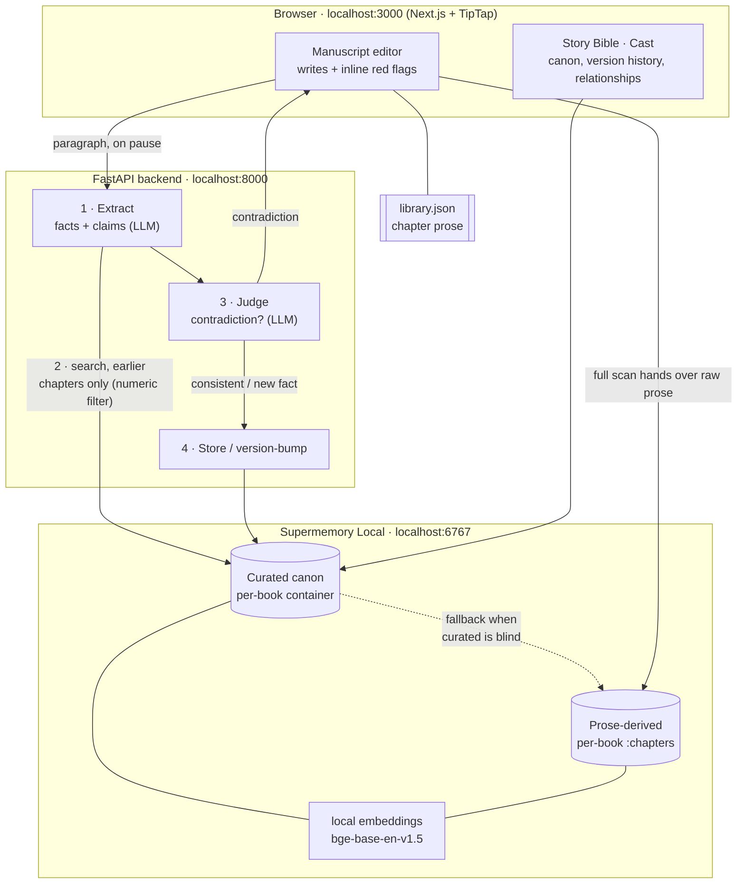

# StoryCanon

**A manuscript editor that catches continuity errors while you write — and remembers your whole story, locally, on Supermemory.**


> Built for the **Supermemory Local Hackathon**. Everything — memory, embeddings,
> search, extraction — runs on your machine. No account, no cloud store.

---

## The problem

You're eighty thousand words into a novel. In chapter one you put your captain in
a wheelchair. By chapter forty you've forgotten, and you write him sprinting across
a courtyard. A character's eyes drift from grey to blue. Someone who was promoted
to Lieutenant is back in a private's coat. A daughter's name changes halfway
through. Nobody catches these until a copyeditor does, six months and one contract
later.

StoryCanon reads every chapter into a memory of your story's **canon**, then flags
the moment new prose contradicts it — inline, as you type, pointing at the exact
earlier line.

```
"Reyes sprinted across the courtyard"   ← flagged
   contradicts, from The Return:
"the war had taken both his legs at Varek Ridge"
   why: Reyes lost both legs, making sprinting impossible.
```

That catch isn't string-matching. Nothing in canon says "Reyes cannot sprint" — the
system reasons from *losing his legs* to the *impossibility of sprinting*. That
reasoning is the product; the memory it reasons over is Supermemory.

---

## How it uses Supermemory Local (and why a vector DB wouldn't do)

Most memory demos are "ingest documents, embed, retrieve nearest chunks." That's a
vector database. StoryCanon leans on the parts of Supermemory a plain vector store
**doesn't have**:

| Supermemory capability | How StoryCanon uses it | Why a vector DB can't |
|---|---|---|
| **Container tags** | One tag per book (`book_{id}`) isolates each manuscript's canon. | Namespacing exists, but it's the least of it. |
| **Numeric metadata filters** | Every fact carries its `chapterIndex`; retrieval filters `chapterIndex < current`, so chapter 4 is only ever judged against chapters 1–3. **"Earlier chapters are canon" is enforced by the query, not hoped for in a prompt.** | Returns nearest chunks regardless of when they were written. No temporal ordering. |
| **Version chains + history** | Accepting a change version-bumps the memory (`update_memory`): the old value is kept with `isLatest=false` and a `rootMemoryId`, so a promotion *supersedes* rather than *overwrites*. The Story Bible renders the full lineage. | Overwrites or duplicates. No first-class "this replaced that, here's the history." |
| **Extraction from raw prose** | Chapters are handed to Supermemory, which derives its own memories and **resolves references** — "His daughter Mira" becomes "Captain Elias Reyes has a daughter named Mira." Used as a fallback when our own extraction is blind. | Embeds text; it doesn't read it into resolved, structured facts. |
| **Forget with a reason** | Cutting a chapter forgets its facts with an audit reason, so they stop haunting later chapters. | Delete is delete; no soft-delete with provenance. |

**What's ours, honestly:** the *continuity judgment* — entailment ("no legs ⇒ can't
sprint"), supersession vs. reversion (promotion is fine; demotion back to a
superseded rank is a contradiction), monotonic age. That reasoning is a prompt layer
on top of what Supermemory returns. **Supermemory is the memory; the judgment is
ours.** We don't claim it detects contradictions — we claim it makes detecting them
possible.

### Two readings of the same manuscript

StoryCanon extracts canon two independent ways and plays them against each other:

- **Curated** (`book_{id}`) — our LLM extracts structured facts with a verbatim
  excerpt (what the red highlight anchors to) and an entity/attribute (what the
  numeric filter and judge need). Precise, but brittle: it can fragment one
  character into `Elias` / `Elias Reyes` / `Reyes`, and a fact it misses is canon we
  never had.
- **Derived** (`book_{id}:chapters`) — Supermemory reads the prose itself and
  resolves references consistently, with higher recall.

When curated canon comes up empty on a query, the checker **falls back to
Supermemory's reading**. Two passes over the same book: ours knows the exact words
to underline; Supermemory's actually knows who everyone is.

---

## Architecture



**The live loop** (per paragraph, as you type): extract facts + claims → search
canon filtered to earlier chapters → judge each against its canon → store new facts
or version-bump changed ones → flag contradictions inline. Worst case is exactly
**two LLM calls** per paragraph (extract + one batched judge), regardless of how
many facts it contains.

**Why prose lives in `library.json`:** Supermemory documents are write-once on the
local server (re-adding a `customId` doesn't replace content), so editable
manuscript text is kept in a local JSON file; Supermemory stays the canon/derived
memory store. A re-sync deletes and re-adds the document so derived memories track
edits.

### Stack

- **Frontend** — Next.js (App Router) · TypeScript · Tailwind v4 · TipTap
- **Backend** — Python · FastAPI · LiteLLM (extraction + judging, e.g. `gpt-4o`)
- **Memory** — Supermemory Local (self-hosted Bun binary) · local `bge-base-en-v1.5`
  embeddings · `gpt-4o-mini` for its own prose extraction

---

## Quick start

**Prerequisites:** Docker + Docker Compose, and one OpenAI-compatible API key
(or local Ollama).

```bash
git clone <your-repo-url> storycanon
cd storycanon

# 1. Configure the two provider keys (both git-ignored)
cp .env.example .env                  # Supermemory's own prose extraction
cp backend/.env.example backend/.env  # our extraction + judging pipeline
#   → put your OpenAI key in both (or point them at Ollama)

# 2. Bring up all three services
docker compose up -d --build
```

- **Editor** → http://localhost:3000
- **API** → http://localhost:8000/health
- **Supermemory** → http://localhost:6767

The Supermemory API key is **auto-discovered** — the backend reads it from the
shared data volume on first boot, so there's no key to copy by hand. Give
Supermemory ~60s on first run to unpack its embedding model.

**Try it:** open the editor, paste a few chapters, and hit **Check Continuity**.
Canon builds as it reads; contradictions light up red. Write a character a
wheelchair in chapter one, then have them run in chapter four, and watch the line
flag itself.

---

## Configuration

Two independent LLM configs, so Supermemory and our pipeline can use different
providers:

| File | Powers | Key variables |
|---|---|---|
| `.env` (root) | Supermemory's extraction of memories from prose | `OPENAI_API_KEY`, `OPENAI_BASE_URL`, `OPENAI_MODEL` |
| `backend/.env` | Our fact extraction + contradiction judging | `EXTRACTOR_MODEL`, provider key (e.g. `OPENAI_API_KEY`), optional `EXTRACTOR_API_BASE` |

`EXTRACTOR_MODEL` is any LiteLLM string — `openai/gpt-4o`, `groq/llama-3.3-70b-versatile`,
`ollama/gemma3:4b`, etc. See each `*.env.example` for the full set.

---

## Repository structure

```
.
├── backend/              # FastAPI: extract → search → judge → store pipeline
│   └── app/
│       ├── memory.py     #   Supermemory client: search, create, version, forget, derive
│       ├── pipeline.py   #   the continuity engine (live check + full scan)
│       ├── prompts.py    #   extraction + judge prompts (the reasoning rules)
│       └── main.py       #   API routes
├── frontend/             # Next.js editor, Story Bible, Cast, landing page
│   └── src/components/   #   ManuscriptEditor, StoryBible, Cast, ContinuityPanel
├── docker-compose.yml    # supermemory + backend + frontend
└── .env.example          # Supermemory provider key
```

---

## Features

- **Live continuity checking** — every paragraph is checked as you write; the
  offending phrase is flagged red inline, with the conflicting earlier line on hover.
- **Full-book scan** — streams per-chapter progress, builds canon end to end, and
  surfaces cross-chapter contradictions on a manuscript it's never seen.
- **Reasoned verdicts** — entailment violations, promotion-vs-reversion, immutable
  attributes, monotonic age — not keyword matching.
- **Story Bible** — a live, auditable view of canon in Supermemory: current facts,
  full version history, and the raw memory record (id, container, version, root).
- **Cast** — a relationship graph (kin, ranks, workplaces) drawn from canon, no
  tagging required.
- **Author-in-the-loop resolution** — you decide whether a new value supersedes the
  old (version-bumped, history kept) or the prose gets fixed.
- **Runs entirely locally** — your manuscript never leaves your machine.

---

## Known limitations

Honest, and mostly upstream. While building we hit four bugs in Supermemory Local
itself — a native segfault under concurrent embedding load, a Workers-only
reranker that throws when self-hosted, a silent list-pagination default (10), and
forgotten memories that can't be read back — each reported separately with repro
and evidence. StoryCanon works around them (bounded concurrency, no rerank,
explicit pagination, hard-delete semantics for forget).

Product-side: extraction is non-deterministic, so a given run may miss one of the
subtler contradictions; entity fragmentation in curated canon can split one
character across names (which the derived reading resolves); and the daughter-rename
case is a genuine reasoning gap, not a retrieval one — the judge treats "a daughter
named Mira" and "father of Lena" as compatible because canon never says he has
exactly one daughter.

---

## Credits

Built on [Supermemory Local](https://supermemory.ai). Continuity reasoning, the
two-reading retrieval model, and the editor are StoryCanon's own.
